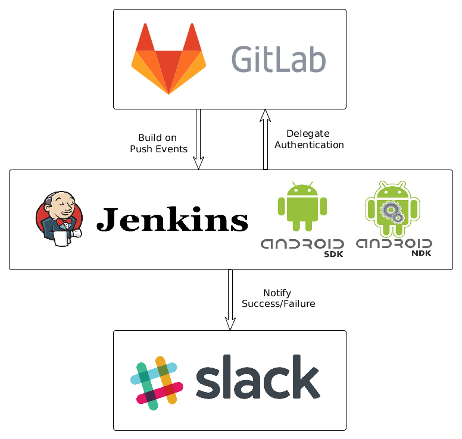
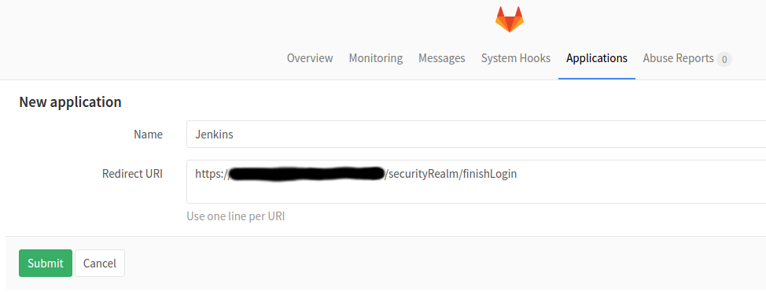
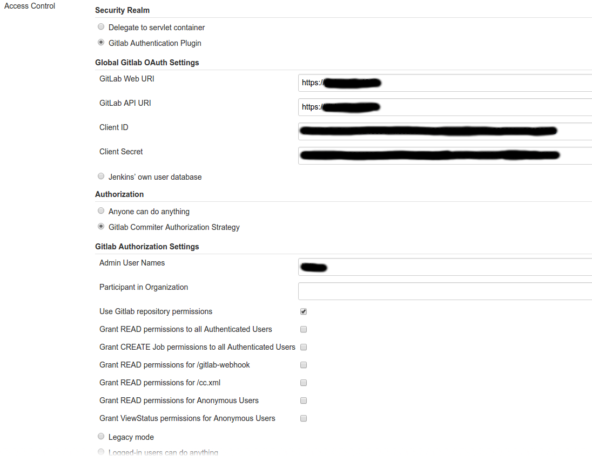
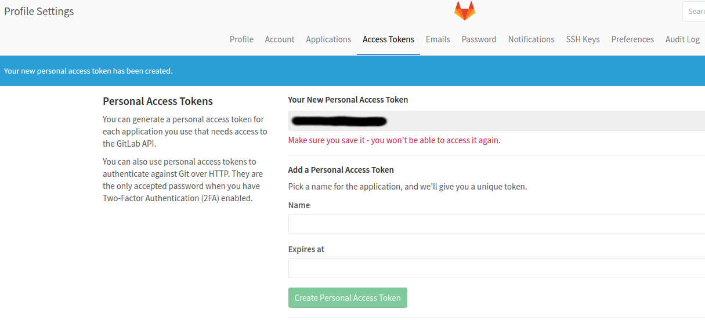
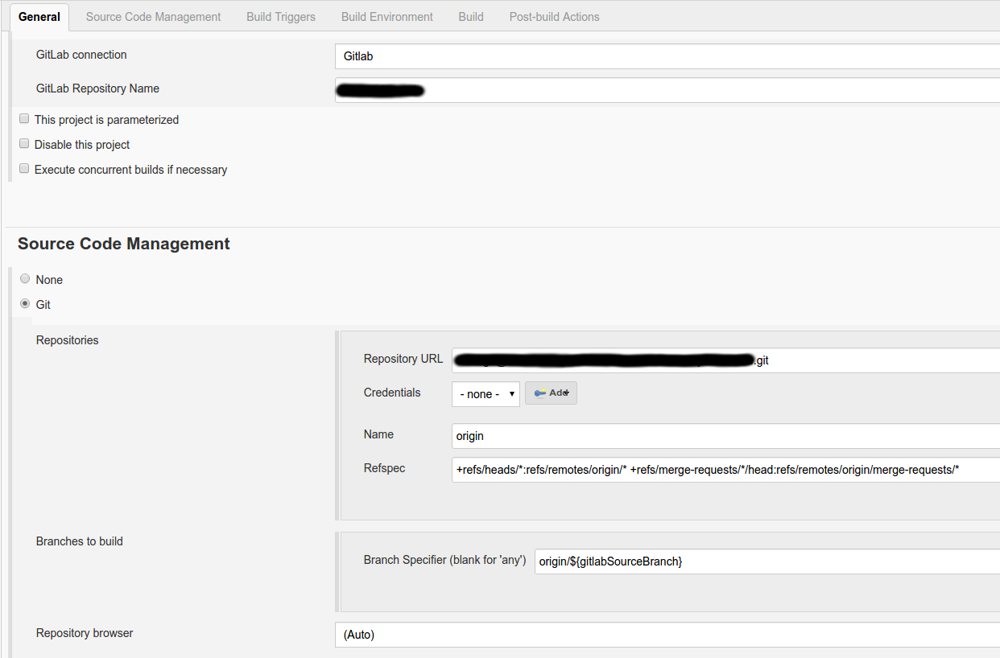
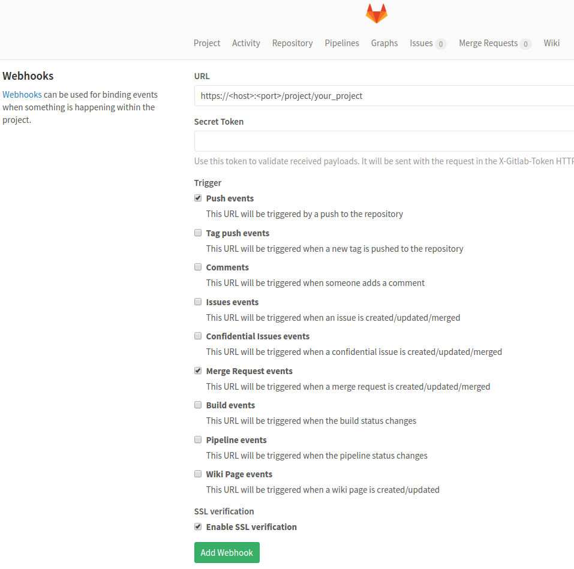

# Jenkins Docker image

[](https://travis-ci.org/akinaru/docker-jenkins)
[](https://microbadger.com/images/akinaru/docker-jenkins)
[](https://microbadger.com/images/akinaru/docker-jenkins)

A jenkins docker image with the following pre-installed plugins :
* <a href="https://wiki.jenkins-ci.org/display/JENKINS/GitLab+Plugin">gitlab-plugin</a> : build trigger on push
* <a href="https://wiki.jenkins-ci.org/display/JENKINS/GitLab+Logo+Plugin">gitlab-logo</a> : gitlab repo icon on dashboard 
* <a href="https://wiki.jenkins-ci.org/display/JENKINS/GitLab+OAuth+Plugin">gitlab-oauth</a> : gitlab authentication
* <a href="https://wiki.jenkins-ci.org/display/JENKINS/Android+Emulator+Plugin">android-emulator</a> : use android emulator in CI
* <a href="https://wiki.jenkins-ci.org/display/JENKINS/Workspace+Cleanup+Plugin">ws-cleanup</a> : clean workspace before build
* <a href="https://wiki.jenkins-ci.org/display/JENKINS/Slack+Plugin">slack</a> : send slack notifications
* <a href="https://wiki.jenkins-ci.org/display/JENKINS/Embeddable+Build+Status+Plugin">Embeddable Build Status Plugin</a> : build status badge



Other packages are also downloaded to build Android applications correctly

## Run

* docker

```
docker run -p 8080:8080 -p 50000:50000 \
           -v your_home/jenkins_home:/var/jenkins_home akinaru/docker-jenkins
```

* docker-compose

https configuration is enabled by default with `keystore.jks` in a `keys` directory :

```
docker-compose up
```

* docker-cloud

Edit `vars-template.sh` configuration, then :
```
source vars-template.sh

envsubst < stackfile-template.yml > stackfile.yml

docker-cloud stack create --name jenkins -f stackfile.yml

docker-cloud start jenkins
```

## Debug

```
docker exec -it jenkins_image bash
```

## Convert server certs to JKS

from <a href="https://maximilian-boehm.com/hp2121/Create-a-Java-Keystore-JKS-from-Let-s-Encrypt-Certificates.htm">this source</a> : 
```
openssl pkcs12 -export -in fullchain.pem -inkey privkey.pem -out pkcs.p12 -name ALIAS

keytool -importkeystore -deststorepass PASSWORD_STORE -destkeypass PASSWORD_KEYPASS \
        -destkeystore keystore.jks -srckeystore pkcs.p12 -srcstoretype PKCS12 -srcstorepass STORE_PASS  \
        -alias ALIAS
```

## Configure Giltab oauth

* In your Gitlab domain go to `Admin` > `Application`

Create a new application with a chosen name and a redirection URI like this : 

* `https://your-jenkins-domain:8083/securityRealm/finishLogin`



Then, you will have generated `Application ID` (client ID) and Secret (Client Secret) : 

<hr/>


<hr/>

* Go to `Manage Jenkins` > `Configure Global Security`

Fill up checking `Gitlab Authentication Plugin` in `Access control` :



<hr/>

Now, Jenkins user will be authenticated via Gitlab

## Configure Giltab push trigger

In `Manage Jenkins` > `Configure System` :


Gitlab URL is : `https://<your host>:<your port>`

<hr/>

Enter a Gitlab API Token that you got from Gitlab in `Profile Settings` > `Access Tokens` :



<hr/>

In your job configuration, Set `GitLab connection` and `Git` repository config as :

* Repository URL : `git@server/repo.git`
* Name : `origin`
* RefSpec : `+refs/heads/*:refs/remotes/origin/* +refs/merge-requests/*/head:refs/remotes/origin/merge-requests/*`
* Branch specifier : `origin/${gitlabSourceBranch}`



<hr/>

In `Build Trigger`, set `Build when a changed is pushed to Gitlab` :


<hr/>

In your gitlab repository go to `Webhooks` :


Then, set the webhook URL as : `https://<jenkins-host>:<port>/project/<your job>` :



<hr/>

## Configure Giltab Logo

In `Manage Jenkins` > `Configure System` :


`Endpoint URL` is : `https://<your-gitlab-host>:<port>/api/v3`

<hr/>

## Configure Slack notifications

* go to https://my.slack.com/services/new/jenkins-ci


<hr/>

In your job configuration, add a Slack Notification `Post Build Action` :


<hr/>

## External Links

* gitlab-plugin setup example : https://github.com/jenkinsci/gitlab-plugin/wiki/Setup-Example
* gitlab-oauth-plugin webhook fix : https://github.com/jenkinsci/gitlab-oauth-plugin/pull/6